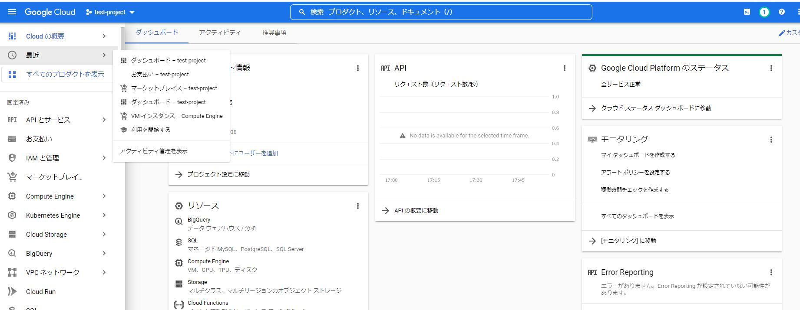
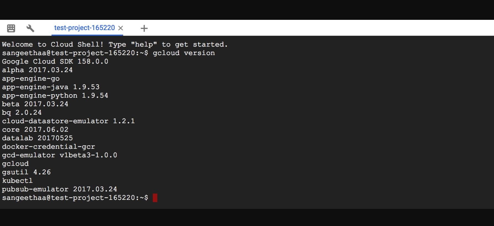
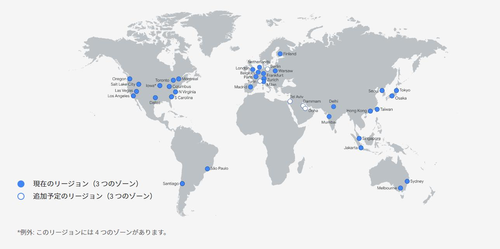

## GCPのメリット

    ディープラーニングや人工知能開発に向いている。
    Tensorflowとの親和性が高い。ビッグデータを扱う技術に長けている。

## GCPのデメリット

    日本語の情報が少ない

## サービスにアクセスする方法

    1. Google Cloud コンソール
    GUIでいろんなリソースを管理。

    2. Google Cloud CLI
    ターミナルで作業可能。

    3. API

## リージョンとゾーン

    リージョン
    GCPがサービスを提供する地域
    データセンターをお設置している地域

    ゾーン
    各リージョン内にある論理的なデータセンター。
    リージョン毎に3つ以上存在

    GCP
    20リージョン、61ゾーン
    AWS
    21リージョン、66AZ
    Azure
    55リージョン

## GCPサービス

### GCPサービスと他サービス

|  サービス  |  GCP  | AWS |  Azure |
| ----      | ----     | ------ | ------ |
|  コンピューティング  | Compute Engine | EC2 | Azure Virtual machines|
|  コンテナ  | Google kubernetes Engine | ECS EKS Fargate | Azure Container Instances  Azure Kubernetes Service|
|  サーバーレスサービス  | Cloud Functions | Amazon lambda | Azure Functions |
|  ネットワーク  | Virtual Private Cloud | Amazon VPC | Virtual Newwork |
|  管理  | Cloud IAM | AWS IAM | Azure AD |
|  ストレージ  | Cloud Storage Persistent Disk Cloud Filestore | Amazon S3 EBS EFS | Azure Blob Storage Managed Disk Azure Files|
|  DB  | Cloud SQL Cloud Spanner | RDS | Azure SQL Database Azure Database for MySql/Postgre Sql|
|  DWH  | BigQuery | Redshift | Azure Synapse Analytics|
|  モニタリング  | Cloud Monitoring | Amazon CloudWatch | Azure monitor |
|  機械学習  | Vertex AI | Amazon Machine Learning | Azure Machine Learning|

## マネジメントサービス

    1.Cloud IAM
    「誰がどのリソースに対して、何ができる？」

    2.Cloud logging
    ログを集計、分析

    3.Cloud Monitoring
    Cloud loggingで集計されたログに対し、エラー発生件数や対応の管理、通知

## コンピュートサービス

    1.Compute Engine
    使用可能なイメージ（OS）
    devian,ubunts,centos,fedora coreos

    マシンタイプ
    汎用　
    コンピューティング最適化
    メモリ最適化
    GPU　機械学習、ハイパフォーマンスコンピューティング、

    2.kubernetes engine
    ヘルスチェックやオートスケーリングを自動で行ってくれる。

    3.App Engine
    バックエンドを構築できるサーバーレスPF。
    使用できる言語が限定されている。

    4.Cloud Functions
    各種イベントをトリガーに、関数を実行するサーバーレスサービス。
    使用例）cloud strageへのファイルアップロードをトリガーにファイルを編集。

    5.Cloud Run
    コンテナを動かすサーバーレスサービス。
    DockerfileとCloud Buildによりコンテナ環境をデプロイ。

    6.Cloud Build
    CI/CDを行うサービス。コードの変更に対し、自動的にテスト、リポジトリにアップロード、本番環境に導入。

    7.Anthos
    ハイブリッドクラウドに対応したアプリケーション管理プラットフォーム。
    稼働中のシステムを最新化（モダナイゼーション）を実現。

    managed services

## ストレージサービス

    1.Cloud Storage
    高耐久性（イレブンナイン）
    高可用性
    暗号化（保存時、通信時（TLS)、Endpointまで）
    使用例：バックアップ、アーカイブ、共有ストレージ

    アクセス管理可能
    IAM,ACL

    2.Transfer Appliance
    外部環境（他クラウド、オンプレミス）からGCP環境にデータ転送を行う。

## ネットワークサービス

    1.Virtual Private Cloud
    Google Cloud上に配置するクラウド空間
    >サブネット・・・VPC内に構成するネットワーク空間。GCPリソースを配置。

    VPC間の通信、サブネット間の通信が可能。

    ファイアウォールの設定が可能

    2.Cloud Load Balancing
    負荷分散。複数リージョン、ゾーンにまたがって分散可能
    外部負荷分散：インターネットからのトラフィックを負荷分散
    内部負荷分散：VPCネットワーク内部で負荷分散

    3.Cloud　CDN（conteents Deliverly Newwork)
    オリジンサーバーのキャッシュ機能。
    レスポンス向上とオリジンサーバーの負荷軽減。

    4.Cloud DNS
    名前解決のサービス。

## データベースサービス

    1.Cloud SQL　(RDS)
    MySQL,PostgreSQL,SQL Server

    2.Cloud Bigtable(NoSQL)
    フルマネージドのkey,valueストア型DB
    大規模データを高速に処理
    低レイテンシで高い応答性能が求められる分析に向く
    再起動を行わずにスケール

    3.Firestore(NoSQL)
    サーバーを介さずクライアントから直接アクセス可能。
    ドキュメント型データベース。

    4.Firebase Realtime Database(NoSQL)
    リアルタイムでデータを保存してユーザー間で同期できる。クラウドホスト型noSQL。
    ・オフライン時にデータを永続化
    ・クライアントから直接接続可能

    5.Memorystore NoSQL (key,value型)
    In memory型DB(IMDB)
    データをメインメモリ（RAM)上に保存するため高速。
    データは揮発性になる。
    Redis型とMemcached型がある。
    使用例）セッション情報、リアルタイム分析等

    6.Cloud Spanner
    RDBの強整合性とNoSQLのスケーリングの特徴を組み合わせたDB
    使用例)ゲームサービスのバックエンド

## 機械学習系サービス

    データパイプライン:データを収集して分析するまでの一連の処理
    収集>処理>蓄積>分析>活用

参照：
HITACHI データ分析を成功へと導くデータパイプライン
https://www.hitachi.co.jp/products/it/bigdata/platform/pentaho/article/data-pipeline/data-pipeline.html#dsp_img

### 収集

    1.cloud Pub/Sub
    多対多の非同期のメッセージングサービス。キューに保存。
    サービス間を疎結合にする。
    非同期化することで大量のデータをリアルタイムに処理できる。

### 処理

    2.Cloud Dataflow
    データパイプラインを実行するためのマネージドサービス。
    データの処理やフィルタリングを行う。
    バッチとストリーミングに対応

    3.Cloud Dataprep
    データクレンジングを行うサービス。（データ処理を行う前に型をそろえたりする）
    GUI操作でデータの探索、変換、異常値の検出が可能。

    4.Cloud Composer
    Apatch Airflow（ジョブ管理ツール）のマネージドツール。
    ビッグデータのデータパイプラインのジョブ管理。
    バッチのジョブを管理。

    5.BigQuery
    フルマネージドのデータウェアハウスサービス。
    マニュアル、バッチ、ストリーミングでデータインポートや格納
    クエリを実行して分析。

    ペタバイト規模の大規模データに対して、高速なクエリの実行
    データ量に応じて、自動でスケールアウト

    6.TensorFlow
    機械学習向けに開発されたオープンソースプラットフォーム。
    GCPと親和性高い。

    構造化データ
    分類、回帰、予測、検出

    非構造化データ
    画像分析、テキスト分析

    7.AI Building Blocks
    GoogleCloudが提供するAIサービスの総称。
    データの前処理、モデル構築、評価、実装をGCP側で行うため、ユーザーはデータのみ用意すればよい。

