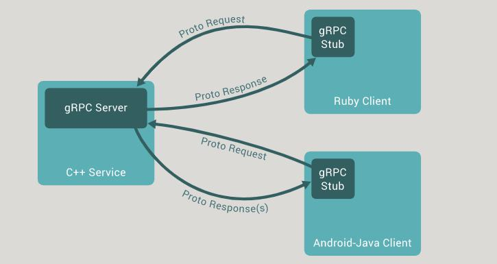

## rpc(remote procedure call)

    関数呼び出しを別の環境に接続して代わりに行う。
    →バックエンドとクライアントがAPI通信ではなく、関数呼び出しでつながる。

## gRPCとは

    rpcを実現するためにgoogleが開発したプロトコルの一つ。
    API仕様をprotocol bufferとして定義してクライアント、サーバーに対してそれぞれコードを生成。

## gRPCとREST API

    1.JSONの代わりにprotocol buffer
    2.HTTP1.1ではなくHTTP2
    3.7~10倍の速さのメッセージ送信
    4.情報が少ないため実装に時間がかかる

## 開発の流れ

    1.gRPCの利用に必要なツールやライブラリのインストール
    2.Protocol Buffersを使ったサービスの定義
    3.サービス定義ファイルからのコードの生成

参照：What is gRPC
https://www.grpc.io/docs/what-is-grpc/introduction/

## 4つの通信方式

    ・Unary RPCs（SimpleRPC)
    1つのデータを受け取って、一つのデータを返す
    用途：サーバー間通信、API、アプリとサーバのデータ送受信

    ・Server streaming RPC
    サーバーからクライアントに複数のリクエストを送る。
    用途：サーバーから任氏のタイミングでクライアントに通知させたいときなど。

    ・Client streaming RPC
    クライアントがサーバに複数のリクエストを送る。
    用途：データアップロードや、クライアントから多くのデータを送る場合。

    ・Bidirectional streaming RPC
    双方向でデータのやり取りをする。（どっちも複数）
    用途：チャットやオンライン対戦など。